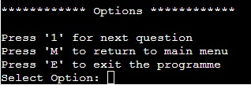

# The Movie Quiz - A console game made with Python

README Contents

1. [About](#about)
2. [Project Goals](#project-goals)
    1. [User Goals](#user-goals)
    2. [Site Owner Goals](#site-owner-goals)
3. [User Experience](#user-experience)
    1. [Target Audience](#target-audience)
    2. [User Requirements and Expectations](#user-requirements-and-expectations)
    3. [User Stories](#user-stories)
4. [Technical Design](#technical-design)
    1. [Flowchart](#flowchart)
5. [Features](#features)
6. [Technologies Used](#technologies-used)
    1. [Languages](#languages)
    3. [Tools](#tools)
7. [Validation and Testing](#validation-and-testing)
    1. [Python Validation](#python-validation)
    2. [Testing user stories](#testing-user-stories)
8. [Bugs](#bugs)
9. [Deployment](#deployment)
10. [Credits](#credits)
    1. [Code](#code)
    2. [Acknowledgements](#acknowledgements)
11. [License](#license)

# Introduction
A quiz where the user is presented with a movie title and needs to guess the year the movie was released. The user is given the option of having a clue to assist their guess but should they not use the clue they will receive bonus points. Once the user has entered their answer, the score is calculated based on the accuracy of the answer. After 5 questions the game is completed and the user is shown their total score.

## Project Goals

### User Goals

- Play a fun little game
- Have a variation of questions
- Interesting scoring system
- Winning

### Site Owner Goals

- Offer a fun game
- Make sure that the user understands the rules
- Make the game feel engaging
- Encourage replayability

## User Experience

### Target Audience

- Everyone who wants to play a little game
- People who want a simple game
- People who like movies

### User Requirements and Expectations

- Easy to navigate
- Can complete multiple games
- Large range of movies

### User Stories

As a user I want to:

1. Start a game
2. Know the rules
3. Know more about the developer
4. Relatively quick game
5. See a large variety of movie titles
6. Know my final score
7. Be guided through the game

## Technical Design

### Flowchart

The following flowchart shows the structure and logic of the The Movie Quiz.

Open flowchart

## Features

The app has 9 features in total

### LANDING PAGE

- First screen seen when programme starts
- Logo with name
- Welcome text and breif description of quiz

### ADD USER NAME

- Also on landing page
- User can enter their name.
- Name is used throughout programme to enhance UX
- Error handling capabilities. Any combination of characters allowed, character limit between 2-9.

### 'TYPEWRITER' EFFECT ON TEXT

- On selected texts throughout the app, text is printed one letter at a time. 
- Improves user UX by adding styling whilst reduce the amount of text suddenly appearing.

### DECORATIVE TITLES

- Each page has a decorative title
- 6 different titles in total
- Improves UX by being big and bold, and setting a tone that is fun.

### MAIN MENU PAGE

- Shows the main menu
- Contains the following options:
    - 1. Start Quiz
    - 2. Quiz Guide
    - 3. About the Developer
    - 4. Exit
- User stories covered: 1, 2, 3
- Error handling capabilities. Only inputs 1, 2, 3 or 4 accepted.
- Error handling avoids repeating main menu options multiple times if multiple incorrect inputs entered

### INSTRUCTIONS PAGE

- Explains how the quiz works
- Directly accessible from the main menu
- Navigates back to the main menu (Error handling capabilities)
- User stories covered: 2

### ABOUT THE DEVELOPER PAGE

- Provides basic information and links to the developers social pages.
- Directly accessible from the main menu
- Navigates back to the main menu (Error handling capabilities)
- User stories covered: 3

### QUIZ PAGE

- Shows logo and how points system works 

- Show current question number out of total number of questions 

- Show movie title 

- Ask user if they want to see a clue
    - Provide example answer format
    - If Y (yes), clue shown, If N (no), programme continues on to answer input
    - Error handling capabilities. Only accepts Y/y or N/n.
    - Error handling avoids repeating multiple lines if multiple incorrect inputs entered 

- Ask user the when the movie was released
    - Provide example answer format
    - Error handling capabilities. Only accepts 4 digits answers between 1950 - 2023.
    - Error handling avoids repeating multiple lines if multiple incorrect inputs entered 

- Provide feedback on user's answer
    - Feedback varies depending on how accurate the answer was, and whether a clue was used. 
    *Correct answer and no clue used* 
     
    *Correct answer with clue* 
     
    *1 year off correct answer with clue* 
     
    *2 years off correct answer without clue* 
     
    *3 or more years off correct answer (regardless if clue is used)* 
    
    

- Show points scored each question, and show total score so far. 

- Consistent and clear navigation on each quiz page
- User stories covered: 1, 4, 5, 7 

### Results Page

- Show user the total score out of total possible score
- Offer user chance to play again, return to menu or exit programme

### 

## Technologies Used

### Languages

- Python

### Tools

- Git
- GitHub
- Heroku - to deploy the app
- Pycodestyle - for validation
- Lucid - for the flowchart [LucidChart](https://www.lucidchart.com/)
- [Regex101](https://regex101.com/) - to test regex expressions

## Validation and Testing

### Python Validation

Python validation was done with pycodestyle linter
The linter showed no errors or other problems

#### Python validation locally

1. pip8 compliant
Screenshot from console

### Testing user stories

#### As a user I want to..

Open Testing

## Bugs

1. 
Bug: Console would not clear entirely in all instances despite use of os.sys('clear')
Solution: The use of os.system('printf "\033c"') was found to be an effective reaplcement.

## Deployment

Heroku:

1. Create an account at Heroku and login.
2. Click the "Create new app" button on your dashboard, add app name and region.
3. Click on the "Create app" button.
4. Click on the "Settings" tab.
5. Under "Config Vars" click "Reveal Config Vars" add your credentials as value with "CREDS" as key.
6. Under "Buildpacks" click "Add buildpack" and then choose "Python" first and click "Save changes"
7. Add a second buildpack "nodejs" and click "Save changes"
8. Go to the "Deploy" tab and choose GitHub as your deployment method
9. Connect your GitHub account
10. Enter your repository name, search for it and click connect when it appears below.
11. In the manual deploy section click "Deploy branch"
12. Optional: You can enable automatic deploys if you want the app to automatically update

You can fork the repository by following these steps:

1. Go to the repository on GitHub  
2. Click on the "Fork" button in the upper right hand corner

You can clone the repository by following these steps:

1. Go to the repository on GitHub
2. Locate the "Code" button above the list of files and click it  
3. Select if you prefer to clone using HTTPS, SSH, or Github CLI and click the "copy" button to copy the URL to your clipboard
4. Open Git Bash
5. Change the current working directory to the one where you want the cloned directory
6. Type git clone and paste the URL from the clipboard ($ git clone <https://github.com/YOUR-USERNAME/YOUR-REPOSITORY>)  
7. Press Enter to create your local clone.

## Credits

### Code

- [ASCII art generator](http://patorjk.com/software/taag/)
- [Console clear function](https://stackoverflow.com/questions/2084508/clear-terminal-in-python)
- [Typing effect](https://stackoverflow.com/questions/20302331/typing-effect-in-python)
- [Overwriting previous console lines](https://stackoverflow.com/questions/36520120/overwriting-clearing-previous-console-line)
- [Prohibit input from user whilst typing effect active](https://chat-gpt.org/)

### Acknowledgements

- A special thanks to my mentor Gareth McGirr for his feedback and advice, especially on the documentation.
- A thanks to the Code Institute for the great learning resources

